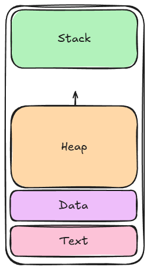

### Stack vs Heap
A memória é dividida em algumas regiões, mas as que mais importam para essa discussão são a **Stack** e o **Heap**.


Basicamente, a stack é uma região de tamanho predefinido, o que torna necessário saber em tempo de compilação o tamanho de tudo o que será alocado nela. Alocar na stack é muito rápido, compacto e eficiente, porém não é possível alocar nada de tamanho dinâmico.

O heap é uma região de memória que pode crescer de forma dinâmica conforme o programa demanda, portanto permite alocar estruturas cujo tamanho não é definido em tempo de compilação. Porém alocar no heap exige procurar por um bloco de memória livre adequado e, se necessário, solicitar novas páginas ao sistema operacional. Esse processo envolve múltiplas [syscalls](https://pt.wikipedia.org/wiki/Chamada_de_sistema), o que o torna significativamente mais lento quando comparado à stack.

 O Rust Book possui um [trecho](https://doc.rust-lang.org/book/ch04-01-what-is-ownership.html#the-stack-and-the-heap) bom e sucinto sobre o assunto.

### O que é Gerenciamento de Memória?
Gerenciar memória é controlar **o quê**, **quanto**, **como** e **quando** é alocado e desalocado dos endereços de memória disponíveis no programa, mas, como já vimos, alocar e desalocar na stack é simples. Portanto, quando falamos de gerenciamento de memória, estamos geralmente falando sobre alocações no heap. Quando trabalhando com uma linguagem que nos faz lidar com as alocações no heap diretamente chamamos esse modelo de gerenciamento manual de memória.

### Gerenciamento Manual
Gerenciamento manual é quando a linguagem exige que você  declare explicitamente quando e quanto alocar, e quando desalocar. Ou seja, controle total sobre as alocações de um programa.
```c
//c
#include <stdlib.h>
void memory_leak(){
    char *ptr = malloc(50);
}

void no_memory_leak(){
    char *ptr = malloc(50);
    free(ptr);
}

int main(int argc, char **argv){
    no_memory_leak();
    memory_leak();
    return 0;
}
```
No exemplo acima podemos ver que na função `memory_leak` não usamos o `free`, isso faz com que quando o escopo acabe nenhuma referência à memória de `*ptr` exista mais, assim, essa memória [vazou](https://pt.wikipedia.org/wiki/Vazamento_de_mem%C3%B3ria) e nunca mais será possível liberá-la (durante a execução do programa). Você pode verificar isso usando uma ferramenta de instrumentação chamada [Valgrind](https://valgrind.org/):
```
$ valgrind ./meu_executavel
==10225== Memcheck, a memory error detector
==10225== Copyright (C) 2002-2017, and GNU GPL'd, by Julian Seward et al.
==10225== Using Valgrind-3.18.1 and LibVEX; rerun with -h for copyright info
==10225== Command: ./a.out
==10225== 
==10225== 
==10225== HEAP SUMMARY:
==10225==     in use at exit: 50 bytes in 1 blocks
==10225==   total heap usage: 2 allocs, 1 frees, 100 bytes allocated
==10225== 
==10225== LEAK SUMMARY:
==10225==    definitely lost: 50 bytes in 1 blocks
==10225==    indirectly lost: 0 bytes in 0 blocks
==10225==      possibly lost: 0 bytes in 0 blocks
==10225==    still reachable: 0 bytes in 0 blocks
==10225==         suppressed: 0 bytes in 0 blocks
==10225== Rerun with --leak-check=full to see details of leaked memory
==10225== 
==10225== For lists of detected and suppressed errors, rerun with: -s
==10225== ERROR SUMMARY: 0 errors from 0 contexts (suppressed: 0 from 0)
```


```c

#include <stdio.h>

int main() {
    char buffer[10];

    printf("Type string: ");
    scanf("%s", buffer);

    printf("You typed: %s\n", buffer);
    return 0;
}
```
Neste outro exemplo pedimos para o usuário digitar uma string de tamanho qualquer como input e escrevemos em um buffer pré-alocado na stack com apenas 10 bytes. Caso o usuário digite algo com mais de 10 bytes o programa vai em tempo de execução tentar escrever em uma memória que está fora das permissões dele e gerar por definição da linguagem um [Undefined Behaviour](https://en.wikipedia.org/wiki/Undefined_behavior#:~:text=In%20computer%20programming%2C%20a%20program,not%20mandate%20any%20specific%20requirements.). Por mais que tenhamos aqui um *UB*[^1] o que vai acontecer na maioria dos casos é o programa crashar. Isso é um bug de memória chamado [Buffer Overflow](https://en.wikipedia.org/wiki/Buffer_overflow), um dos bugs mais comuns e que mais geram vulnerabilidades de segurança. Diversos estudos[^2] mostram que mais de 60% das vulnerabilidades em software vem de erros de memória.

Hoje em dia, poucas linguagens fazem uso de gerenciamento manual, uma outra notória é a linguagem [Zig](https://ziglang.org/). E existem 2 motivos para isso:
1. Ergonomia: desenvolver em linguagens que permitem não pensar em gerenciamento de memória é mais fácil e agradável.
2. [**Error Prone**](https://errorprone.info/): É frequente um desenvolvedor cometer erros e vazar memória, ou pior, gerar um Bug de memória.

### Garbage Collection
Garbage collection é uma técnica de gerenciamento de memória que provê uma limpeza automática de tudo aquilo que se considera "lixo", que é memória que não precisa estar mais alocada. A grande questão é quando considerar uma memória como lixo de forma segura, para isso as duas principais técnicas de *GC*[^3] são [Reference Counting](https://en.wikipedia.org/wiki/Reference_counting), que se baseia em contar quantas referências a um valor existem e quando esse contador chegar a zero essa memória é liberada automaticamente, e [Tracing](https://en.wikipedia.org/wiki/Tracing_garbage_collection) que se baseia em rastrear objetos acessíveis a partir de pontos de entrada chamados Root.
```python
# python
def create_n_sized_list():
    x = ""
    lst = []
    while x != "stop":
        x = input("type a number: ")
        lst.append(x)
    print(lst)

create_n_sized_list()
```
No exemplo acima em python criamos uma lista alocada no heap, ao final da função `create_n_sized_list()` o escopo dela se fecha e mais nenhuma referência à lista existe, portanto o garbage collector sabe que pode liberar essa memória de forma segura. A vantagem de se usar Garbage Collectors é evidente: melhora notória na DevEx[^4].

A desvantagem está na perda de causada pelo GC rodando checar as referências ou fazer o tracing dos objetos. 

### Conclusão
Garbage Collection e Gerenciamento Manual são os dois modelos de gerenciamento de memória mais conhecidos, porém não os únicos. No meu Learn in Public de Rust vou falar sobre um terceiro tipo que é uma inovação da linguagem e sua feature mais única.

---

### Para se Aprofundar
- [WHY IS THE STACK SO FAST?](https://www.youtube.com/watch?v=N3o5yHYLviQ) <small>meu canal de computação favorito btw</small>
- [WHY IS THE HEAP SO SLOW?](https://www.youtube.com/watch?v=ioJkA7Mw2-U&t=518s)
- [how do hackers exploit buffers that are too small?](https://www.youtube.com/watch?v=qpyRz5lkRjE)

---

[^1]: **U**ndefined **B**ehaviour.
[^2]: Alguns artigos de big techs comentando sobre a quantidade e as consequências de erros de memória:
    - [Apple Memory Safety](https://langui.sh/2019/07/23/apple-memory-safety/)
    - [Microsoft - We need a safer systems programming language](https://www.microsoft.com/en-us/msrc/blog/2019/07/we-need-a-safer-systems-programming-language)
    - [Google - Queue the Hardening Enhancements](https://security.googleblog.com/2019/05/queue-hardening-enhancements.html)

[^3]: **G**arbage **C**ollector
[^4]: **Dev**eloper **Ex**perience.
