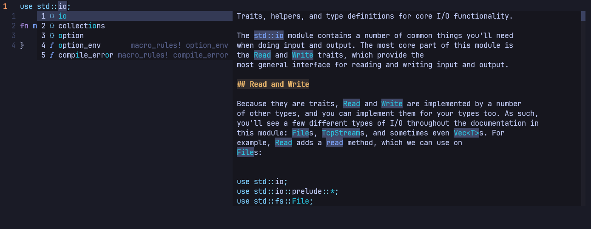

Essa série vai registrar minha jornada aprendendo [Rust](https://github.com/rust-lang/rust) e vai culminar em algum primeiro projeto (talvez um servidor HTTP ou algum tipo de CLI). Vou sempre estar listando as fontes dos conteúdos que tenho usado pra estudar mas o principal vai ser o livro [The Rust Programming Language](https://doc.rust-lang.org/book).

> [!NOTE] Disclaimer
> Vou focar nas partes que mais me chamarem a atenção na linguagem então coisas simples como declaração de variável ou assinatura de funções devo deixar de fora dos posts

---

Uma das ferramentas que mais me ajudam a aprender uma linguagem nova são os [LSPs](https://microsoft.github.io/language-server-protocol/), no caso de rust o [rust_analyzer](https://github.com/rust-lang/rust-analyzer). Ter a documentação no hover e no autocomplete ajuda a manter o foco dentro do editor e evitar distrações externas.


Além disso como o compilador de rust é muito descritivo os diagnósitcos do `rust_analyzer` são muito úteis pra identificar rápidamente erros de sintaxe e tipos:
```rust
error[E0308]: `if` and `else` have incompatible types
 --> src/main.rs:4:44
  |
4 |     let number = if condition { 5 } else { "six" };
  |                                 -          ^^^^^ expected integer, found `&str`
  |                                 |
  |                                 expected because of this

For more information about this error, try `rustc --explain E0308`.
error: could not compile `branches` (bin "branches") due to 1 previous error
```
Imagino que quando começarmos a adentrar os pantanos mais complexos como procmacros ou lifetimes as mensagens vão ficando cada vez mais complexas (espero nunca ver stack traces parecidos com erros de compilação de Templates em CPP98) mas por enquanto fiquei impressionado

### Imutabilidade
Uma feature que a qualidade pode passar despercebida por muitos é a imutabilidade by default, que além de manter o código seguro impedindo alteração acidental de valores também o deixa mais legível sempre tendo `mut` denotando pra leitores o que é mutável e o que não é. Um outro ponto positivo é que manter varias variáveis imutaveis e ir criando novas (sem aplicar shadowing) [ajuda quando usando um debugger](https://x.com/id_aa_carmack/status/1983593511703474196) pois sempre se tem disponível todas as etapas da transformação.

### Statements VS Expressions
Rust tem esses dois conceitos bem definidos e entender isso tem importancia na interpretação do código. `statements` são instruções que performam uma ação e **não retornam um valor**, `expressions` *evaluate*[^1] para um valor resultante:
```rust
let y = 6; // let é um statement que binda um valor na variável y
let x = 5 + 6; // 5 + 6 é uma expression que gera 11, fazendo parte de um statement
let z = {
    let a = 3;
    a + 1 // sem ponto e virgula denota o "retorno" do bloco dessa expression
}
let s = sum(10, 25) // Chamar funções são expressions
let i = if true { 10 } else { 25 }; // Ifs são expressios
```

Não gostei da questão de `;` ter o valor semântico implicito de terminar apenas statements, da mesma forma que detesto a sintaxe de [exportação em Go](https://go.dev/tour/basics/3), preferiria que usassem uma keyword `pub`/`public`. Também não sou fã dessa idéia de implicit return, a ultima expressão num escopo ser retornada, preferiria que existisse a obrigatoriedade de `return` explícito. Gosto de expressividade especialmente nesses casos onde não torna adiciona verbosidade.

### Fontes
- [Statements and Expressions](https://doc.rust-lang.org/book/ch03-03-how-functions-work.html#statements-and-expressions)
- [Variables and Mutability](https://doc.rust-lang.org/book/ch03-01-variables-and-mutability.html#variables-and-mutability)

[^1]: [*evaluate*](https://en.wikipedia.org/wiki/Evaluation) é uma palavra muito dificil de se traduzir, vou escolher manter palavras assim em ingles.
